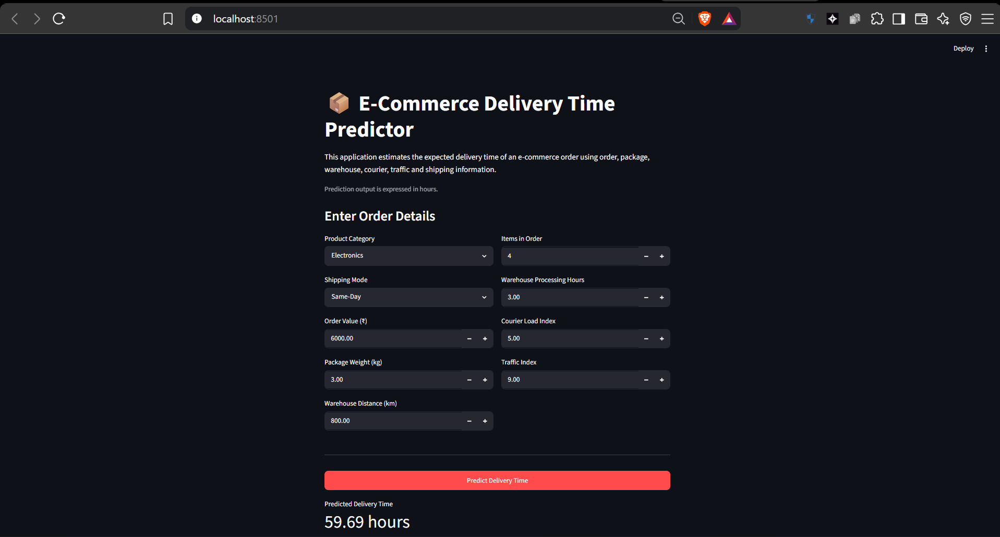

# E-Commerce Delivery Time Prediction

## Project Overview

This project develops a Multiple Linear Regression model to estimate the
delivery time of an e-commerce order.

The project covers the complete workflow from raw business data to a
deployed prediction application, including data-quality assessment,
regression-assumption diagnostics, model training, evaluation, model
persistence, and deployment using Streamlit.

## Business Problem

Accurate delivery-time estimation can support e-commerce managers in
delivery planning, operational coordination, logistics management, and
customer expectation management.

The model predicts:

**Delivery_Time_Hours**

## Dataset

The dataset contains e-commerce order and operational characteristics.

### Predictor Variables

The model uses the following predictors:

- Product_Category
- Shipping_Mode
- Order_Value
- Package_Weight_Kg
- Warehouse_Distance_Km
- Items_in_Order
- Warehouse_Processing_Hours
- Courier_Load_Index
- Traffic_Index

`Order_ID` is retained as an identifier during data analysis but is not
used as a regression predictor.

## Data Preparation

The data-preparation workflow includes:

- Missing-value analysis and treatment
- Duplicate detection and removal
- Standardisation of inconsistent categorical values
- Identification and correction of impossible values
- Investigation of data-entry errors
- Outlier analysis using the IQR method
- Investigation of influential observations using standardized residuals,
  leverage, and Cook's Distance

## Linear Regression Assumptions

The following assumptions and diagnostics were examined:

- Linearity
- Multicollinearity using correlation analysis and VIF
- Independence of errors using the Durbin-Watson statistic
- Homoscedasticity using residual-versus-fitted analysis and the
  Breusch-Pagan test
- Normality of residuals using histogram, Q-Q plot and Jarque-Bera test
- Outlier and influence analysis using IQR, standardized residuals,
  leverage and Cook's Distance

After corrective treatment, the regression model was re-fitted and the
major assumptions were re-checked.

## Model Development

Multiple Linear Regression was used as the primary predictive model.

An 80:20 train-test split was used for predictive evaluation.

The final machine-learning workflow uses a scikit-learn Pipeline so that
the same preprocessing steps are applied during both training and
prediction.

### Numerical Preprocessing

Missing numerical predictor values are imputed using the median.

### Categorical Preprocessing

Missing categorical values are imputed using the most frequent category.

Nominal categorical predictors are converted using one-hot encoding.

## Model Evaluation

The model is evaluated using:

- R-squared
- Adjusted R-squared
- Mean Absolute Error (MAE)
- Mean Squared Error (MSE)
- Root Mean Squared Error (RMSE)
- Residual analysis

The detailed model results and diagnostic outputs are available in
`model_training.ipynb`.

## Saved Model

The complete preprocessing and Multiple Linear Regression Pipeline is
saved as:

`model.pkl`

The Streamlit application loads this saved Pipeline directly and does not
retrain the model when the application starts.

## Web Application

The Streamlit application allows users to enter:

- Product category
- Shipping mode
- Order value
- Package weight
- Warehouse distance
- Number of items
- Warehouse processing time
- Courier load index
- Traffic index

The application then displays the estimated delivery time in hours and
provides a short managerial interpretation.

## Application Screenshots

### Input Interface


### Prediction Output



## Project Structure

```text
project/
│
├── ecommerce_delivery_unclean_data.csv
├── model_training.ipynb
├── model.pkl
├── app.py
├── requirements.txt
├── README.md
│
└── screenshots/
    ├── app_inputs.png
    └── app_prediction.png
---

## Copyright

© 2026 Arin Bakshi. All Rights Reserved.

This project, including its original source code, documentation, application
interface, and project-specific model files, may not be copied, modified,
redistributed, published, or used commercially without prior written
permission from the author.

Third-party libraries, frameworks, course materials, and other externally
sourced components remain subject to their respective licenses and ownership.